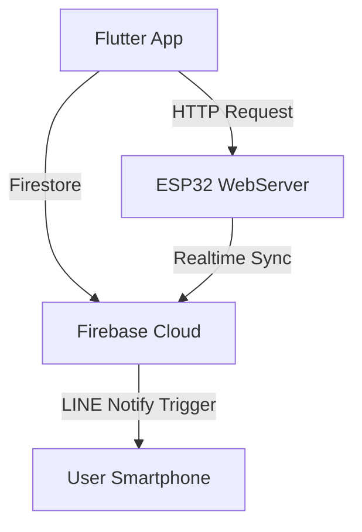

# 💊 Smart Pillbox System (ESP32 + Flutter + Firebase)

A cross-platform smart medication assistant combining **ESP32 hardware control**, **Flutter user interface**, and **Firebase cloud synchronization**. This system helps users manage medication schedules, receive notifications, and maintain accurate daily records.

---

## 🧠 System Architecture



---

## 📱 Flutter App Overview

A beautiful, intuitive user interface that lets users:

-   Set up medication schedules and reasons
-   Choose time periods (morning, lunch, dinner, before sleep)
-   Browse daily medication records in a calendar view
-   Interact with ESP32 remotely via HTTP

### 🔘 Screens & Features

| Screen                   | Features                                             |
| ------------------------ | ---------------------------------------------------- |
| **HomePage**             | Entry screen with user guide & precautions           |
| **MainPage**             | Input medication time, duration, and reasons         |
| **MedicineTimeRecorder** | View calendar-based intake records with color status |
| **Tabbar**               | App navigation via two main tabs: Setup / Record     |

---

## 🤖 ESP32 Embedded System

The ESP32 controls hardware modules like relay locks and buzzers. It reads medication schedule from Firebase and performs:

-   💡 Smart unlocking of pill compartments
-   🔔 Sound notifications via buzzer
-   📨 LINE Notify alerts before and after dose times
-   ⏰ NTP time synchronization
-   🌐 WebServer for Flutter HTTP requests
-   🔁 Firestore: create/update medication records

### GPIO Pin Mapping

| Component         | GPIO |
| ----------------- | ---- |
| Relay Box 1       | 2    |
| Relay Box 2       | 4    |
| Buzzer            | 18   |
| Magnetic Switch 1 | 12   |
| Magnetic Switch 2 | 13   |

---

## ☁️ Firebase Cloud Firestore

Firebase is the core backend, used for:

-   Storing user schedule info (`date_and_time_settings/yyyy-MM-dd`)
-   Logging actual intake times (`record/yyyy-MM-dd`)
-   Realtime update via `StreamBuilder` in Flutter

### Firestore Document Example

```json
/date_and_time_settings/2024-06-14 {
  "breakfast_hour": [7],
  "dinner_minute": [30]
}
/record/2024-06-14 {
  "breakfast_hour": 7,
  "breakfast_state": 0,
  "dinner_state": 2
}
```

---

## 📦 Project Structure

```
smart-pillbox/
├── esp32/                  # ESP32 Arduino sketch
│   └── smartpillbox.ino
├── flutter_app/
│   ├── main.dart
│   ├── firebase_options.dart
│   ├── tabBar.dart
│   ├── main_page.dart
│   └── medication_calendar.dart
```

---

## 🚀 Getting Started

### ESP32 Setup

1. Flash code with Arduino IDE or PlatformIO
2. Install libraries:
    - Firebase ESP Client
    - ArduinoJson
    - NTPClient
3. Fill in WiFi & Firebase credentials in `smartpillbox.ino`
4. Upload to ESP32, monitor serial logs

### Flutter App Setup

```bash
flutter pub get
flutterfire configure  # Already done
flutter run
```

---

## 📚 Dependencies

### Flutter

-   `firebase_core`
-   `firebase_auth`
-   `cloud_firestore`
-   `table_calendar`
-   `dropdown_button2`

### ESP32

-   `Firebase_ESP_Client`
-   `ArduinoJson`
-   `WiFi` / `HTTPClient` / `WebServer`
-   `NTPClient` / `TimeLib`

---

## 📊 Medication Status Indicator

| Color     | Meaning               |
| --------- | --------------------- |
| 🟢 Green  | Took medicine on time |
| 🟡 Yellow | Delayed intake        |
| 🔴 Red    | Missed dose           |

---

## 📩 LINE Notify Integration

Used for real-time reminders (e.g., 15 or 30 minutes before scheduled time).

-   Requires a personal access token from LINE Notify portal
-   API call sent via `HTTPClient` from ESP32

---

## 📝 License

MIT

---

## 🙌 Authors

-   ESP32 + Physical Devices: _Chih-Hsuan, Shen & Yi-Li, Kuo_
-   Flutter UI Developer + Firebase Developer: _Min-Yu, Liang & Yun-Chieh, Chang_

> "A smarter way to take your meds, one beep at a time."
